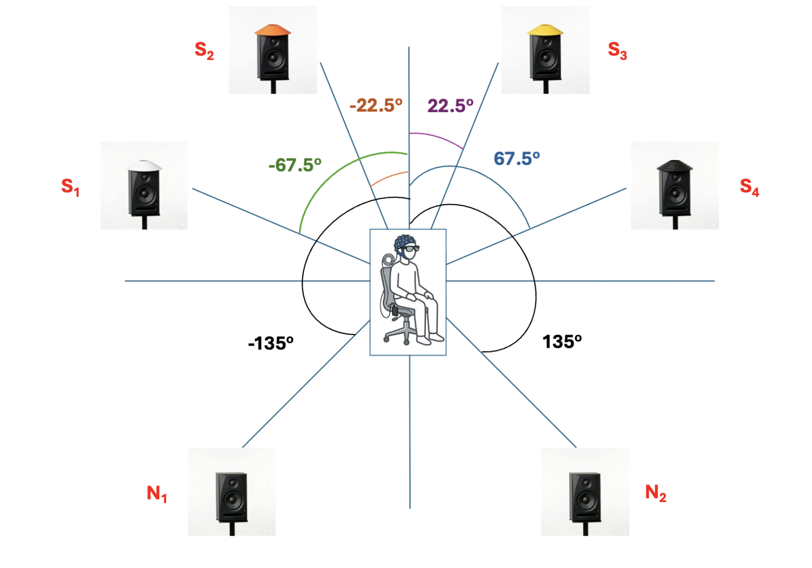

# MAESTRO Benchmark

Official benchmark code for the **MAESTRO** dataset — the Multimodal Auditory-attention Egocentric Speech-TRacking Open corpus. This repository contains the preprocessing pipeline, baseline models, training scripts, and pre-computed results for all three benchmark tasks defined in the accompanying paper.

> **Dataset:** [HuggingFace — aspire-osu/maestro-eeg-dataset](https://huggingface.co/datasets/aspire-osu/maestro-eeg-dataset)

---



## Overview

MAESTRO is a 16-subject, 100-trial multimodal auditory attention decoding (AAD) dataset. Each trial records five synchronised data streams while participants listen to four simultaneously presented speakers and attend to one:

| Modality | Device | Rate |
|---|---|---|
| EEG (32 ch) | ANTNeuro eego mylab | 500 Hz |
| Gaze + pupillometry | Tobii Pro Glasses 3 | ~50 Hz |
| IMU (accel + gyro) | Tobii Pro Glasses 3 | ~120 Hz |
| Egocentric video | Tobii Pro Glasses 3 | 25 fps |
| Audio (4 speakers + 2 noise) | 6 loudspeakers | 16 kHz |

---

## Benchmark Tasks

Every task is evaluated at **five decision window sizes** (5, 10, 15, 20, 30 s). T1 is evaluated under **both** official split protocols; T2 and T3 are evaluated under LOSO only.

| Task | Description | Chance | Splits evaluated |
|---|---|---|---|
| **T1** | Four-class attended source decoding | 25% | within-subject, leave-one-subject-out (LOSO) |
| **T2** | Attended hemisphere decoding (left vs right) | 50% | LOSO |
| **T3** | Attended eccentricity decoding (inner vs outer) | 50% | LOSO |

**within-subject**: 5-fold cross-validation, folds defined by trial content and pooled across all 16 subjects (content generalization).
**LOSO**: 16 folds, one held-out subject per fold, trained on the other 15 (subject generalization).

Both protocols read the dataset's own official split definitions from `splits/{within,loso}/fold_*.json` rather than reconstructing splits internally — see [Dataset Format](#dataset-format).

---

## Results

All tables report accuracy (mean ± std across folds — 5 folds for within-subject, 16 held-out subjects for LOSO) across all five decision window sizes. **"Best fusion" results are produced by `late_fusion.py`**: it combines the *independently-trained, frozen* single-modality checkpoints via a small learned softmax-weighted combiner — it does **not** retrain the encoders. "Best fusion" is the best-performing combination among all 11 multi-modality combinations (6 pairs, 4 triples, 1 full four-way combination) at that specific task/split/window, shown in parentheses — it is not always the full four-modality combination, and the winning combination is not fixed across window sizes.

Full per-mode results for all 15 modality combinations, paired significance testing against EEG-only, and the SNR-stratified analysis are reported in the paper and provided as JSON files under `results/`.

### T1 — Four-class attended source decoding, within-subject (chance 25%)

| Window | EEG | Gaze | IMU | Video | Best fusion |
|---|---|---|---|---|---|
| 5s | 47.58% ± 6.18% | 47.65% ± 4.69% | 47.29% ± 5.09% | 48.95% ± 6.00% | 49.97% ± 6.03% (Gaze+IMU+Video) |
| 10s | 47.64% ± 7.95% | 48.54% ± 5.61% | 49.85% ± 6.85% | 48.99% ± 3.03% | 53.42% ± 6.20% (EEG+IMU+Video) |
| 15s | 48.94% ± 7.39% | 50.29% ± 4.58% | 49.01% ± 6.77% | 47.71% ± 3.12% | 51.76% ± 5.63% (EEG+Gaze+IMU+Video) |
| 20s | 52.87% ± 7.83% | 51.80% ± 5.14% | 48.05% ± 10.28% | 43.12% ± 5.03% | 53.99% ± 5.79% (Gaze+IMU) |
| 30s | 53.06% ± 8.77% | 53.87% ± 3.89% | 50.36% ± 5.19% | 45.50% ± 9.25% | 55.13% ± 6.33% (EEG+IMU) |

### T1 — Four-class attended source decoding, leave-one-subject-out (chance 25%)

| Window | EEG | Gaze | IMU | Video | Best fusion |
|---|---|---|---|---|---|
| 5s | 49.70% ± 2.59% | 50.01% ± 2.50% | 49.92% ± 2.42% | 50.42% ± 2.55% | 50.90% ± 2.83% (IMU+Video) |
| 10s | 44.63% ± 6.47% | 49.19% ± 5.69% | 46.18% ± 5.68% | 46.73% ± 3.34% | 50.73% ± 2.82% (Gaze+Video) |
| 15s | 45.93% ± 6.45% | 47.45% ± 4.68% | 48.42% ± 5.98% | 48.65% ± 5.45% | 50.06% ± 6.55% (IMU+Video) |
| 20s | 50.63% ± 6.34% | 50.16% ± 6.88% | 52.37% ± 7.17% | 51.56% ± 6.55% | 49.85% ± 7.42% (EEG+Gaze) |
| 30s | 51.88% ± 5.27% | 53.90% ± 6.56% | 52.38% ± 7.53% | 51.56% ± 2.91% | 55.51% ± 6.90% (Gaze+IMU) |

### T2 — Attended hemisphere decoding, LOSO (chance 50%)

| Window | EEG | Gaze | IMU | Video | Best fusion |
|---|---|---|---|---|---|
| 5s | 68.50% ± 2.06% | 70.30% ± 2.75% | 68.78% ± 2.45% | 68.10% ± 3.41% | 70.25% ± 2.56% (EEG+Gaze+Video) |
| 10s | 78.47% ± 2.58% | 78.44% ± 2.80% | 76.22% ± 3.41% | 77.29% ± 2.81% | 73.24% ± 3.26% (EEG+Gaze) |
| 15s | 70.84% ± 3.25% | 70.23% ± 3.87% | 65.71% ± 5.05% | 67.45% ± 3.50% | 71.15% ± 4.03% (EEG+Gaze) |
| 20s | 72.19% ± 6.37% | 69.26% ± 7.34% | 69.92% ± 6.32% | 71.88% ± 5.27% | 72.75% ± 4.57% (EEG+Video) |
| 30s | 73.13% ± 10.73% | 75.49% ± 8.71% | 69.93% ± 7.62% | 68.75% ± 6.96% | 75.49% ± 7.56% (EEG+Gaze) |

### T3 — Attended eccentricity decoding, LOSO (chance 50%)

| Window | EEG | Gaze | IMU | Video | Best fusion |
|---|---|---|---|---|---|
| 5s | 59.24% ± 2.20% | 60.13% ± 2.91% | 59.58% ± 1.87% | 58.21% ± 1.36% | 60.57% ± 2.49% (Gaze+IMU) |
| 10s | 53.22% ± 2.03% | 54.32% ± 3.42% | 53.96% ± 2.82% | 53.47% ± 2.69% | 60.70% ± 1.84% (Gaze+IMU) |
| 15s | 61.41% ± 4.22% | 60.61% ± 4.08% | 61.03% ± 4.83% | 61.23% ± 5.21% | 63.13% ± 4.37% (Gaze+Video) |
| 20s | 68.44% ± 4.23% | 66.13% ± 6.04% | 64.29% ± 7.57% | 66.25% ± 6.96% | 69.29% ± 4.88% (EEG+Gaze+IMU+Video) |
| 30s | 67.19% ± 5.85% | 62.06% ± 7.12% | 64.59% ± 6.66% | 62.50% ± 7.71% | 65.86% ± 7.02% (EEG+Video) |

Full per-mode results for all 15 modality combinations, all four single-modality checkpoints (5 folds for within-subject, 16 subjects for LOSO), and the SNR-stratified analysis are provided as JSON files under `results/`.

---

## Repository Structure

```
MAESTRO/
├── scripts/
│   ├── dataloader.py               # Preprocessing, sync, windowing, PyTorch Dataset, official-split loading, mode registry
│   ├── model_classification.py     # Multi-encoder dilated conv network for T1 (4-class)
│   ├── model_spatial.py            # Binary variant for T2/T3 (hemisphere, eccentricity)
│   ├── train_aad.py                # T1 — single modality, either split_setting (within or loso)
│   ├── train_hemisphere.py         # T2 — single modality, either split_setting
│   ├── train_eccentricity.py       # T3 — single modality, either split_setting
│   ├── late_fusion.py              # Combines independently-trained single-modality checkpoints via a learned softmax combiner — produces every multimodal result
│   ├── analyze_snr.py              # SNR-stratified accuracy, reusing existing single-modality + late-fusion checkpoints (no retraining)
│   └── dl_maestro.py               # Dataset download script with rate-limit handling and HF token auth
└── results/
    ├── results_aad_within_w{5,10,15,20,30}_h{2.5,5,7.5,10,15}/     # T1 within-subject — checkpoints (5 folds × 4 modalities) + result JSONs, one folder per window size
    ├── results_aad_loso_w{5,10,15,20,30}_h{...}/                  # T1 LOSO — checkpoints (16 subjects × 4 modalities) + result JSONs
    ├── results_hemisphere_loso_w{5,10,15,20,30}_h{...}/           # T2 — checkpoints + result JSONs
    ├── results_eccentricity_loso_w{5,10,15,20,30}_h{...}/         # T3 — checkpoints + result JSONs
    ├── results_late_fusion/         # Late-fusion results for all 11 multi-modality combinations, per task/split/window
    └── results_snr/                 # Output of analyze_snr.py — SNR-stratified accuracy (currently computed for T1 only)
```

Each `results_{task}_{split}_w{window}_h{hop}/` folder name encodes exactly the run that produced it (task, split protocol, window size, hop size), matching what `late_fusion.py` and `analyze_snr.py` expect via `--ckpt_dir`.

---

## Installation

```bash
git clone https://github.com/NaimulHassan/MAESTRO
cd MAESTRO
pip install -r requirements.txt
```
> **Note:** PyTorch must be installed separately to match your CUDA version. See [pytorch.org](https://pytorch.org/get-started/locally/) for the correct install command. Tested with Python 3.7.16, PyTorch ≥1.13, and CUDA 11.8.

## Downloading the Dataset

The dataset is publicly available on HuggingFace. Use the provided download script, which handles rate limiting automatically by downloading in batches with retries:

```bash
export HF_TOKEN=hf_your_token_here
python scripts/dl_maestro.py --local_dir maestro-data
```

Or pass the token directly (not recommended for shared/committed code — prefer the `HF_TOKEN` environment variable so the token never ends up in shell history, scripts, or version control):

```bash
python scripts/dl_maestro.py --local_dir maestro-data --token hf_your_token_here
```

To download specific subjects only:

```bash
python scripts/dl_maestro.py --local_dir maestro-data --subjects 1 2 3
```

The script downloads in three sequential phases — metadata, official splits, and root files (`metadata/*`, `splits/*`, `README.md`, `LICENSE`), per-subject modality data (EEG, gaze, IMU parquet files), and media (audio, video, timing) — with a short pause between batches to stay within HuggingFace's free-tier rate limits. If no token is provided (neither `--token` nor `HF_TOKEN`), the script prints a warning and proceeds anyway, which is fine for the public dataset but required for any private/gated access.

---

## Dataset Format

The dataset follows a partitioned Parquet layout:

```
/data/maestro/
├── splits/
│   ├── within/fold_0.json ... fold_4.json    # 5-fold content-based split, pooled across all 16 subjects
│   └── loso/fold_00.json ... fold_15.json    # 16-fold subject-based split, one held-out subject each
├── metadata/
│   ├── trials.csv              # Trial metadata (trial_id, attended_speaker, kind, snr_db, ...)
│   ├── bad_channels.csv        # Per-subject bad EEG channel list
│   ├── audio_layout.json       # Speaker-to-file mapping and azimuth angles
│   └── eeg_channels.json       # Channel names and montage
├── data/
│   ├── eeg/subject=S01/trial=eval_001.parquet    # Columns: t_sec, sample_idx, ch_Fp1, ..., ch_O2
│   ├── gaze/subject=S01/trial=eval_001.parquet   # Columns: t, gaze2d_x/y, gaze3d_x/y/z, L/R_pupil, ...
│   └── imu/subject=S01/trial=eval_001.parquet    # Columns: t, ax, ay, az, gx, gy, gz
└── media/
    ├── audio/<trial_id>/speaker{N}_dev{D}_{L|R}_spkid{ID}.flac
    ├── video/subject=S01/eval_001.mp4
    └── timing/subject=S01/trial=eval_001.json    # Unified sync timestamps (anchor_unix, end_unix, per-stream offsets)
```

`within/fold_N.json` is a pure content-based split (every subject appears in both train and test, on disjoint trial content, verified zero-overlap across folds). `loso/fold_NN.json` is a pure subject-based split (the held-out subject's trials are the test set; no separate content holdout, since the same ~100 stimuli are shared across all subjects). All scripts read these files directly via `dataloader.load_official_splits()` as the authoritative source of train/test partitioning — splits are never reconstructed internally.

---

## Usage

All scripts take `--local_path` as the dataset root, `--split_setting` (`within` or `loso`), and `--window_sec`/`--hop_sec` to select the decision window (defaults to the dataset's native 30 s window if left unset). An optional `--cache_dir` caches preprocessed features so subsequent runs load instantly.

### Step 1 — Train each single modality

T1, T2, and T3 each have their own training script. Train the four single modalities (`eeg`, `gaze`, `imu`, `video`) separately — this is what the paper's reported results are built from:

```bash
# T1 — within-subject, 30s window
python scripts/train_aad.py --local_path maestro-data --mode eeg --split_setting within --window_sec 30 --hop_sec 15

# T1 — LOSO
python scripts/train_aad.py --local_path maestro-data --mode eeg --split_setting loso --window_sec 30 --hop_sec 15

# T2 — hemisphere (LOSO only)
python scripts/train_hemisphere.py --local_path maestro-data --mode eeg --split_setting loso --window_sec 30 --hop_sec 15

# T3 — eccentricity (LOSO only)
python scripts/train_eccentricity.py --local_path maestro-data --mode eeg --split_setting loso --window_sec 30 --hop_sec 15
```
Repeat with `--mode gaze`, `--mode imu`, `--mode video`. Each run writes checkpoints and a result JSON to `--results` (defaults to `results_{task}` — pass a folder matching the naming convention above if you want it discoverable by `late_fusion.py`'s auto-detection).

> **Note on multimodal `--mode` values:** `--mode` also accepts multi-modality combinations directly (e.g. `--mode eeg_gaze_imu_video`), which trains a single jointly-fused model end-to-end using `model_classification.py`'s built-in concatenation fusion. **This is a different code path from the paper's reported multimodal results.** Every multimodal number in the paper comes from Step 2 below (`late_fusion.py` combining independently-trained single-modality checkpoints), not from training a multi-modality mode directly.

### Step 2 — Late fusion (produces every multimodal result)

Requires the four single-modality checkpoints for a given task/split/window to already exist (from Step 1):

```bash
# One multi-modality combination
python scripts/late_fusion.py --task aad --split_setting loso --mode eeg_gaze_imu_video \
    --local_path maestro-data --cache_dir /cache --window_sec 30 --hop_sec 15 --combine learned

# Sweep all 11 multi-modality combinations, plus fold in the 4 existing single-modality results
python scripts/late_fusion.py --task aad --split_setting loso --mode all \
    --local_path maestro-data --cache_dir /cache --window_sec 30 --hop_sec 15 \
    --combine learned --skip_existing
```

`--task` accepts `aad`, `hemisphere`, or `eccentricity`. `--ckpt_dir` defaults to `results_{task}_{split_setting}_w{window_sec}_h{hop_sec}` (matching Step 1's default output folder) — pass it explicitly if you used a custom `--results` path in Step 1. `--skip_existing` lets an interrupted `--mode all` sweep resume without re-running modes that already finished.

### SNR-stratified analysis

Reuses the already-trained single-modality and late-fusion checkpoints — no retraining required:

```bash
python scripts/analyze_snr.py --task aad --split_setting loso --local_path maestro-data \
    --cache_dir /cache --window_sec 30 --hop_sec 15 \
    --late_fusion_dir results_late_fusion --results results_snr
```

Runs the 4 single modalities plus exactly one multimodal mode: the best-performing combination for that exact (task, split, window) auto-selected from your existing `--late_fusion_dir` output. Pass `--modes` explicitly to override this. Run once per window size (and per split) for a full sweep — see `results/results_snr/` for the naming convention this produces.

### Supported modes

All 15 non-empty combinations of the four modalities are supported, in a canonical `eeg_gaze_imu_video`-style naming scheme. Three short legacy aliases are also accepted for backward compatibility.

| Mode | Input |
|---|---|
| `eeg`, `gaze`, `imu`, `video` | Single modality (4) |
| `eeg_gaze`, `eeg_imu`, `eeg_video`, `gaze_imu` (alias `gi`), `gaze_video`, `imu_video` | Pairs (6) |
| `eeg_gaze_imu`, `eeg_gaze_video` (alias `eeg_vg`), `eeg_imu_video`, `gaze_imu_video` | Triples (4) |
| `eeg_gaze_imu_video` (alias `eeg_vgi`) | Full combination (1) |

---

## Preprocessing

All modalities are resampled to 64 Hz. Missing samples in gaze and IMU are handled per channel by dropping invalid samples before interpolation.

| Modality | Pipeline |
|---|---|
| EEG | 60 Hz notch → bandpass 1–40 Hz (4th-order Butterworth, filtfilt) → bad-channel detection (flat: std < 1e-9; saturated: ≥10% of samples at the ADC clip; or outlier variance via a MAD-based threshold on first-difference variance relative to the other good channels) → mastoid-preferred reference (good mastoid channels if available, otherwise full-channel average) → spherical-spline interpolation of bad channels via MNE if installed (falls back to an average-reference with no interpolation otherwise) → per-channel z-score → downsample 500→64 Hz |
| Audio | **Raw waveform RMS-equalized to the trial's shared target** (mean RMS across that trial's own 4 speakers, computed before enveloping — this equalizes attended-vs-competing loudness so the model can't decode attention from raw audio energy alone) → Hilbert envelope → low-pass 20 Hz (4th-order Butterworth) → downsample 16000→64 Hz → z-score |
| Gaze | Per-channel NaN drop → linear interpolation to 64 Hz grid → low-pass 10 Hz (4th-order Butterworth) → z-score |
| IMU | Per-channel NaN drop → linear interpolation to native sampling rate → resample to 64 Hz → low-pass 20 Hz (4th-order Butterworth) → z-score |
| Video | Downsample frames to 160×90 → grayscale conversion → Farneback dense optical flow between consecutive frames → 4 statistics per frame pair (mean/std flow magnitude, mean horizontal/vertical flow) → resample native fps→64 Hz → z-score |

Synchronisation uses the unified timing JSON (`media/timing/`): EEG filtering runs on the full unmasked trial recording before windowing (so filter edge transients fall outside the analysis window), with all streams subsequently aligned to a shared anchor/end timestamp per trial. Each of the 4 speakers' audio is additionally aligned using its own per-device playback-start timestamp (`audio_device_t0`) rather than one shared reference, correcting for inter-device recording lag before the RMS target is computed.

---

## Baseline Models

A multi-encoder causal dilated convolutional network (`model_classification.py` for T1, `model_spatial.py` for T2/T3 — identical encoder design, binary output). Each active modality is processed by a dedicated encoder and projected to a shared embedding width.

| Encoder | Layers |
|---|---|
| EEG | 7 + 1×1 spatial conv |
| Audio | 7 (shared weights) |
| Gaze | 6 |
| IMU | 6 |
| Video | 4 |

**Two distinct ways multi-modality inputs are combined, depending on how the model is invoked:**
- **Single-modality mode** (`--mode eeg`, etc.): the one active modality's embedding is compared directly against the audio embedding via cosine similarity. This is what every checkpoint under `results/` actually is, and what the paper's four single-modality columns report.
- **Multi-modality `--mode`, trained directly**: the model concatenates all active modalities' projected embeddings and passes them through a shared `Linear + ReLU` fusion layer before comparing against audio — a jointly-trained, early-fusion alternative. **Not used to produce the paper's reported multimodal numbers** (see the note in [Usage](#usage)); those come exclusively from `late_fusion.py` combining frozen single-modality checkpoints via a separate, later-stage learned combiner.

All encoders use a uniform 16-dimensional embedding width. Training: Adam lr=1e⁻⁴, label smoothing 0.1, gradient clipping 1.0, early stopping patience 10. Each cross-validation fold is seeded independently (including a mode-dependent offset) so different modality combinations sharing a fold never receive identical model initialization.

---

## Citation

If you use MAESTRO in your research, please cite:

```bibtex
@article{hassan2025maestro,
  title   = {{MAESTRO}: A Multimodal Auditory-attention Egocentric Speech-TRacking Open Corpus},
  author  = {Hassan, K M Naimul and Alavi, Seyed Ali and Williamson, Donald},
  journal = {TBD},
  year    = {2026}
}
```

---

## License

[](https://creativecommons.org/licenses/by-nc-sa/4.0/)

`SPDX-License-Identifier: CC-BY-NC-SA-4.0`

This code and dataset are released under the [Creative Commons Attribution-NonCommercial-ShareAlike 4.0 International License (CC BY-NC-SA 4.0)](https://creativecommons.org/licenses/by-nc-sa/4.0/). You are free to share and adapt the material for non-commercial purposes, provided you give appropriate credit and distribute any derivative works under the same license.